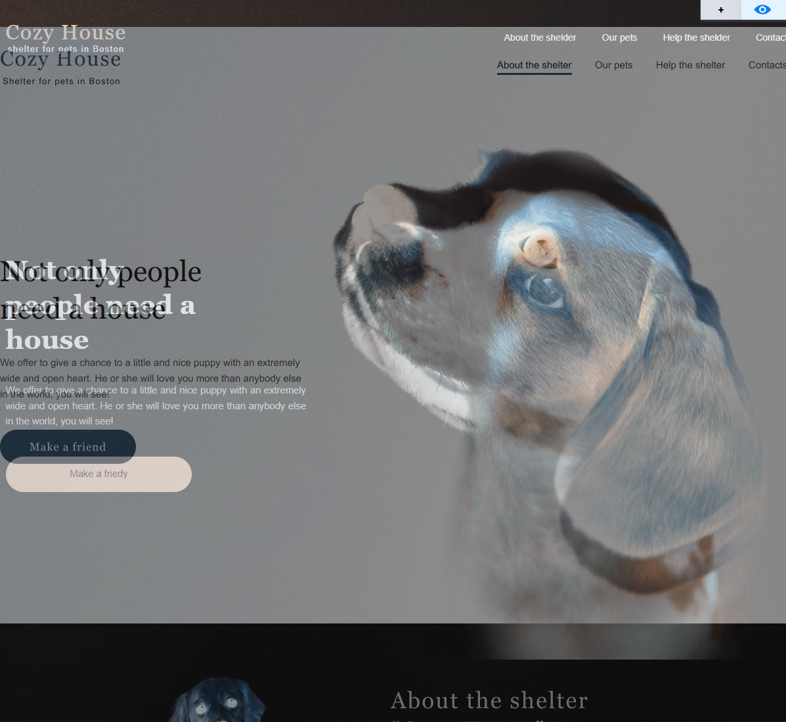
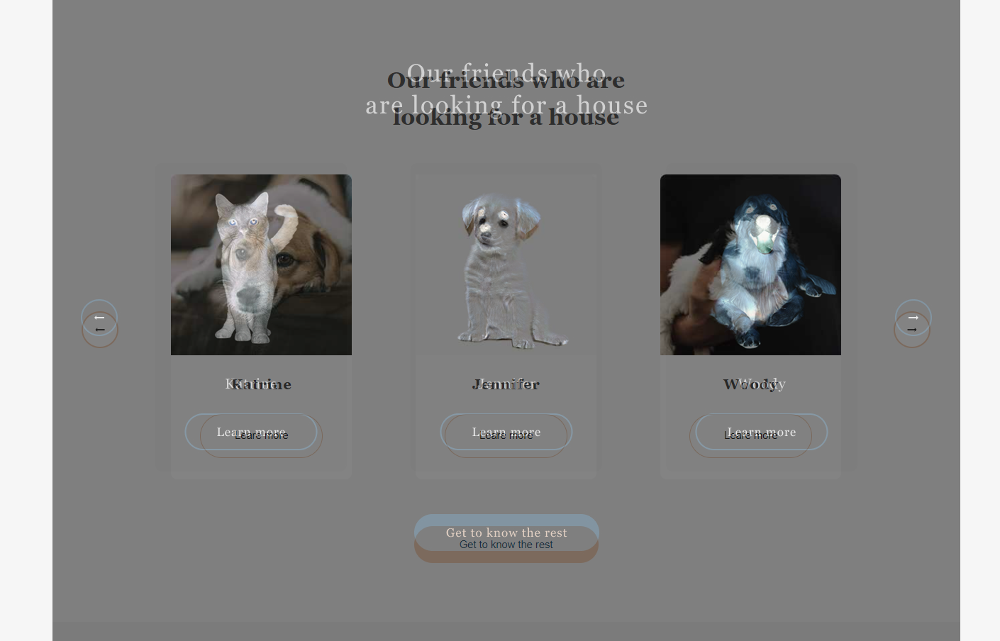

## Requirements:

<!--  complete: &#09989; 
      incomplete: &#10071; 
      unperform: &#10060; 
      note: &#08505; 
      warning: &#09888; 
      ## Unperformed and incomplete items:
-->

### Page Main (36.5/60)
1. &#10071; Layout check (3/7)

    - &#10060; valid layout (correspond [validator](https://validator.w3.org/)) (0/4)
      > [validator report](https://validator.w3.org/nu/?doc=http%3A%2F%2Fs29645vv.beget.tech%2FNataliaPW%2Fshelter%2F) returns 2 errors
    - &#09989; header logo consists of text elements (1/1)
    - &#09989; page contains the only `&lt;h1>` element (1/1)
    - &#09989; `favicon` is added (1/1)

2. &#10071; Layout corresponds figma draft (17.5/35)

    - &#09989; block `&lt;header>` (5/5)
      > layout error `7px` (logo)
    - &#10060; block `Not only` (0/5)
      > layout error `>10px`  
      > wrong title style, button width  
      > wrong background position/section height  
      > 
    - &#10071; block `About` (2.5/5)
      > wrong sectioin paddings  
      > wrong title font style (font size, line height, letter spacing)  
      > 
    - &#10071; block `Our Friends` (2.5/5)  
      > wrong title, card caption font styles  
      > 
    - &#10071; block `Help` (2.5/5)
      > wrong title text, style  
      > wrong elements caption style  
      > wrong elements layout (is caused by fixing alignment, no downgrade)  
      > 
    - &#10071; block `In addition` (2.5/5)
      > wrong title, descriptions styles  
      > wrong elements spacing (`>10px` total)  
      > wrong credit-card field style (width `+30px`, border radius , padding)  
      > 
    - &#10071; block `&lt;footer>` (2.5/5)
      > wrong grid layout
      > wrong background layout 
      > excess third party content
      > 

3. &#09989; CSS Requirement (6/6)

    - &#09989; flexbox or grid is used for `Help` block (2/2)
    - &#09989; page content aligns center if window width is more than 1280px (2/2)
    - &#09989; background color is stretched to full page width (2/2)

4. &#10071; Elements interactions (10/12)

    - &#09989; `About the Shelter` Element is highlighted and inactive, other navigation elements are interactive (2/2)
      > Isn't applied until page skrolling
    - &#10060; Each pet-card in block `Our friends` is interactive at full area (0/2)
      > Cards are inserted as photo gallery (propbply with libs) and don't work as required
    - &#09989; Smooth anchor crolling (2/2)
    - &#09989; All linkages are processed according linkage list at `Main` page (2/2)
      > Credit card empty link isn't performed  
      > Page logo likn isn't empty
    - &#09989; Completed interaction for links and buttons. Should contain not only cursor changing but also use draft interactions design (2/2)
      > footer links show no hover/active behavior, while poiner is shown at full list area hover (instead of link hover only)
    - &#09989; Interactive changes should be applied smoothly (2/2)
      > slider scrolling button, logo, navigation links (color) aren't transitioned smoothly

### Page Pets (27/40)
5. &#10071; Layout check (3/7)

    - &#10060; valid layout (correspond [validator](https://validator.w3.org/)) (0/4)
      > [validator report](https://validator.w3.org/nu/?doc=http%3A%2F%2Fs29645vv.beget.tech%2FNataliaPW%2Fshelter%2Fpets-page.html) returns 7 errors  
      > 5 of them are coused by use `` inside for closing, instead of `` 
    - &#09989; header logo consists of test elements (1/1)
    - &#09989; page contains the only `&lt;h1>` element (1/1)
    - &#09989; `favicon` is added (1/1)

6. &#10071; Layout corresponds figma draft (10/15)

    - &#09989; block `&lt;header>` (5/5)
      > layout error `=10px` (no downgrade)
    - &#10071; block `Our Friends` (2.5/5)
      > wrong title, card caption font styles  
      > wrong card height causes layout error `>10px` in total  
      > wrong card button height (error `>10px`)  
      >   
      > wrong layout at window width `>1280px`  
      >   
    - &#10071; block `&lt;footer>` (2.5/5)
      > wrong grid layout  
      > wrong background layout  
      > excess third party content  
      > 

7. &#09989; CSS Requirement (4/4)

    - &#09989; page content aligns center if window width is more than 1280px (2/2)
    - &#09989; background color is stretched to full page width (2/2)

8. &#10071; Elements interactions (10/14)

    - &#10071; `Our pets` Element is highlighted and inactive, other navigation elements are interactive (1/2)
      > `Our pets` isn't inactive, and causes header bug (all links are hovered)  
      > 
    - &#10071; Accessable pagination buttons (to right) are active, inccessable pagination buttons (to left) are inactive (1/2)
      > inccessable buttons are active  
      > 
    - &#10060; Each pet-card in block `Our friends` is interactive at full area (0/2)
      > Cards are inserted as photo gallery (propbply with libs) and don't work as required
    - &#09989; Smooth anchor crolling (2/2)
    - &#09989; All linkages are processed according linkage list at `Main` page (2/2)
    - &#09989; Completed interaction for links and buttons. Should contain not only cursor changing but also use draft interactions design (2/2)
    - &#09989; Interactive changes should be applied smoothly (2/2)
      > slider pagination button, logo, navigation links (color) aren't transitioned smoothly

## Penalties:

2. &#09888; Forbidden libraries or frameworks is used (-100)
  - 5. Outdated libraries are forbidden (JQuery and so on.)
    > index.html #821: ``

## Rank 0/100
  **63.5** before penalties

## Notes:
  - Full review with screenchots you can find at [Github](https://github.com/nduchin/RSSchool-cross-check)
